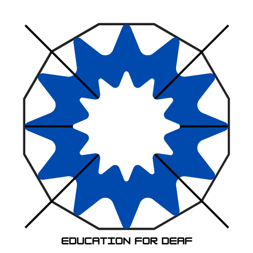

	
	 
	 
	 
	 
	

		Check out Free Education for Deaf (coming soon)
		 
		<h2>
			<a href="https://github.com/E-2xi/free-education-for-deaf">Free Education for Deaf</a>
			 
			Go to learn without limit
		</h2>
	

	 
	 
	 
	 

## Contents 
- [For Elementary students](#for-elementary-students)
- [For Middle students](#for-middle-students)
- [For High students](#for-high-students)
- [Deaf resources](#deaf-resources)
- [Deaf Services](#deaf-services)
- [Deaf Education](#deaf-education)
- [Higher Education](#higher-education)

## For Elementary students

### Math 
-[Math Concepts in ASL](https://www.youtube.com/watch?v=XCJXsJN0DBY&list=PL60GgJ-A96ix_5YaoxuZYSPljrrGbs_H6) - A professor at RIT/NTID who are deaf explains math concepts in highly accurate ASL.

### English 
## For Middle students 

## For High students 

## Deaf resources 

### Finance  
-[Financial Literacy in American Sign Language (FYIFI)](fyifi.org) - This organization provides Financial Literacy in ASL within guide to be successful in Finance. 

### Further discover more deaf resources
-[Browse the index of deaf resources](https://tndeaflibrary.nashville.gov/resources/browse-index)

## Deaf services

## Deaf Education 

## Higher Education 

